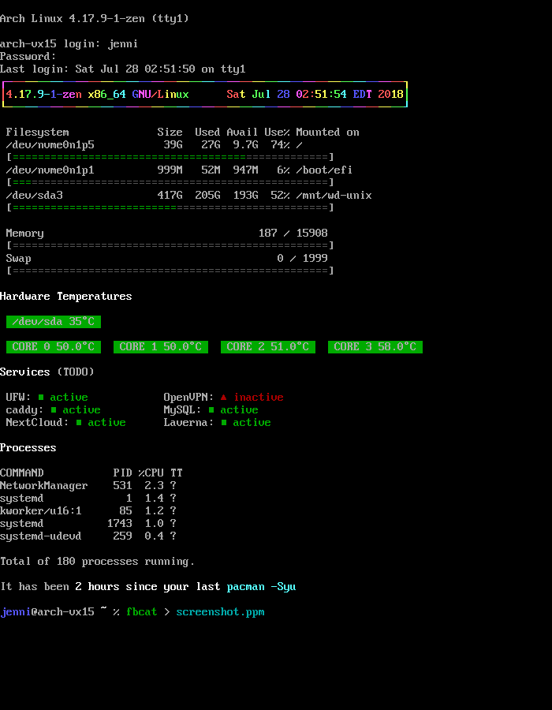

System information MOTD in pure bash for Arch Linux.

Heavily inspired by [FalconStats](https://github.com/Heholord/FalconStats), perhaps this is simply an opinionated reimplementation.



Dependencies (that you probably have already): `bash ncurses coreutils gawk sed procps-ng pacman`

Dependencies (that you might not have): `lm_sensors hddtemp`

**hddtemp needs sudo permissions to run.** *sudo* commands can execute without prompting for a password by a certain user (eg. *jenni*) by adding the line below to `sudo visudo`

```
jenni ALL=(ALL) NOPASSWD: /usr/bin/hddtemp
```

```bash
cd "${BASH_SOURCE%/*}" || exit
source .env
```